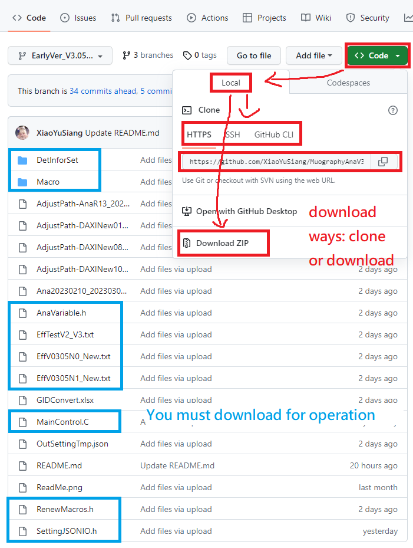
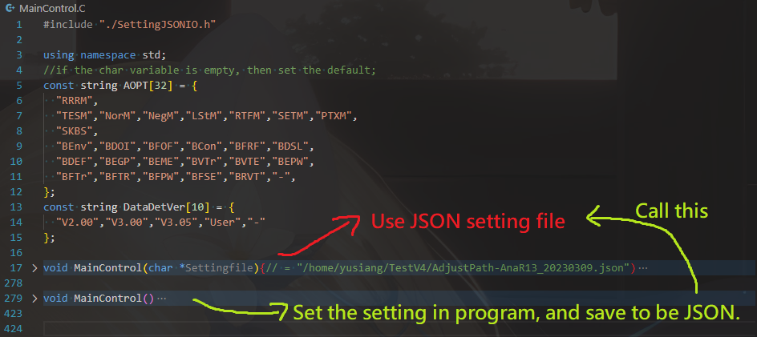
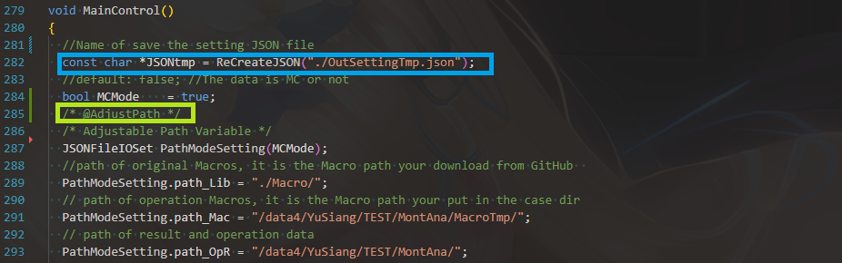
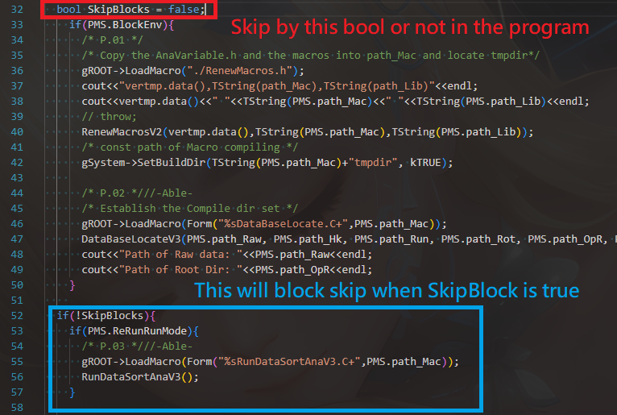

#  Warning! Emvoriment Setting problem

### Maincontrol can't work without some emviroment (I guess CVMFS).

### In the problem the MainControl.C can't use the macros by:

    gROOT->LoadMacros("xx.C" or "xx.C+");

### The solution is use **"chip02.phy.ncu.edu.tw"** and add the two line in your **".bashrc"**:

    source /data4/cmkuo/root/bin/thisroot.sh
    source /cvmfs/cms.cern.ch/cmsset_default.sh

# Introduction of MuographyAnaV3.05Det-verV2(ver 20230329)

## This is the Public Muography Analysis program for:

* Both **Geant4 Monte Carlo data(New)** and **experimental data**
* Support detector versions V02.00, V03.00, V03.05.

## Q: How to use?

### 00. Check process environment.

* Check if your computer can work on **CVMFS** and **ROOT** environment.
* See the imformation top of the article.

### 01. Download the program

* You can save the program on the github by .zip or use url commend... onto your computer
* The following graph shows which one is essential files.
  * PS: The following graph shows: **Red** drawing is **how to download**, and **blue** is you **must download**.

<!--    Ps: If you wan use multiple cpu to analyze the different "run" data parallelly.
    You can download the Run.C to same dir, and set the parameter like the MainControl.C.-->

### 02. Revise the analysis variable setting in the **"AnaVariable.h"**.
* Generally, it's <b>not often to change</b> the trigger for anylize, and default fitting function parameter.
* In Geant4 MC analisys:
  * Set the channel id in G4 MC data to be the real detector general channel id(gid).
  * The setting is save in the array: **int G4GIDToGID[X][Y]**. X is the index of generation of detector version. Y is the G4GID, G4GIDToGID[X][Y] is the real detector GID for the same place channel.
* Same art style for color palette...

### 03. Decide the way to process MainControl in **MainControl.C**.
* **MainControl(JSON file name)**:
  * **Load** the operation setting in the JSON setting file to process the program.
* **MainControl()**:
  * **Create** JSON file to save the operation setting and call to process the program.
  * After create the JSON file, **call**  MainControl(JSON file name) to operate.
* Easy process:

* After editing the settings in the main program and executing it, a configuration file will be generated. You can save this configuration file or modify its contents for future use.
  + PS: **"OutSettingTmp.json"** is the default file for generate in the program.
    + You can also revise default name: ***JSONtmp** = ReCreateJSON("**New_JSON_Name.json**");

## First time to use the program, you could change the setting in MainControl().

* The fast way is ctrl+f to find the marker @AdjustPath to dajust.
* Graph for adjust JSON Setting file name and where is the **@AdjustPath**

### 04. Set the boolean MCMode
    bool MCMode    = true;
* If you use the MC data, the MCMode turn to be true.
* The default value is false for experimental data.

### 05. Set operation and macros path in "MainControl.C".
    PathModeSetting.path_Lib = "./Macro/";
    PathModeSetting.path_Mac = "/data4/YuSiang/TEST/MontAna/MacroTmp/";
    PathModeSetting.path_OpR = "/data4/YuSiang/TEST/MontAna/";
* **"path_Lib"**: Path of original Macros, the /Macro path you download from github on you computer.
* **"path_Mac"**: Path of operation Macros, the individual macro dictionary path for this study.
* **"path_OpR"**: Path of output data (result & operation data)

### 06. Check and set the detctor version and setting:
    PathModeSetting.det_ver  = "V3.05";
* **"det_ver"** : Detector version of search the detector imformattion file in /DetInforSet/.
* The setting of det_ver related to how program choose the detector imformation.
* Please enter the setting to be:
  * **"V2.00"** : The 4x4 Shimen det. setting is "/DetInforSet/DetSetV0200.h".
  * **"V3.00"** : The 8x8 loose det. setting is "/DetInforSet/DetSetV0300.h".
    * ps: 12mm cross gap in the middle of detector.
  * **"V3.05"** : The 8x8 tight det. setting is "/DetInforSet/DetSetV0305.h".
    * ps: Flip MTBs to prevent the cross gap
* If need to change the imformation of detector setting for some test, please enter the setting to be:
  * **"User"** : The det. setting is "/DetInforSet/DetSetUserSet.h".
    * Then, edit the file content in the **"/DetInforSet/DetSetUserSet.h"**.

### 07. Set the path and data Run data information:
    PathModeSetting.path_Run = "/data4/YuSiang/TEST/OdetData/";
* **"path_Run"** : Path of the runs data for detector information (Setup_*.txt).
* Format of Setup_*.txt should be like the example files: **"/data4/YuSiang/TEST/OdetData/Setup_\*.txt"**
* **Warning**: all Run files in the **"path_Run/"** directory cannot have only contain **Setup_\*Run0\*.txt**, otherwise it will cause errors.

## For set !MCMode(use Exp. data) see 08a. , amd set MCMode(use MC data) see 08b.
    if(PathModeSetting.MCMode){
      PathModeSetting.path_MC  = "/data4/AndyLu/to_cw/";
      PathModeSetting.name_MC  = "4_4_4_starightbeam_merge.root";
    }else{
      PathModeSetting.path_Raw = "/data4/YuSiang/DAXIFIX/RawMu/";
      PathModeSetting.path_Hk  = "/data4/YuSiang/DAXIFIX/RawHK/";
      PathModeSetting.name_Raw = "*Run1[0,1]*_*Mu*";
      PathModeSetting.name_Hk  = "*Run1[0,1]*_*HK*";
    }
### 08a. Set the path name of G4 MC data file

* **"path_MC"** : **"Path"** of the G4 MC data for muon
* **"name_MC"** : **"Data"** of the G4 MC data for muon name want to search (ex: MC*.root)

### 08b. Set the path name of exp. data file

* **"path_Raw"** : path of the raw data for muon (*_Mu.txt)
* **"path_Hk"** : path of the raw data for House keeping (*_HK.txt)
* **"name_Raw"** : Data name of raw muon data want to search!!
* **"name_Hk"** : Data name of raw house keeping data want to search!!

## PS: Search data name

    A directory contain 3 files:    Name1.txt & Name.txt & N.txt
    Ex1. case for name_Raw = "Name":
        Will analyze the file: Name.txt
    Ex2. case for name_Raw = "Name*":
        Will analyze the file: Name.txt & Name1.txt
    Ex3. case for name_Raw = "*":
        Will analyze the file: Name.txt & Name1.txt % N.txt

* See more: **"Regular Expression"**, ex: https://www.guru99.com/linux-regular-expressions.html

### 09. Set The path to save the RAW.root data
    PathModeSetting.path_Rot = "/data4/YuSiang/TEST/MontAna/rootfile/";
* **path_Rot**: default: "./MacroTmp/"
* The RAW.root contain two case because MCMode:
  * **Exp. data**: Raw_Mu.txt -----CaConvertor.C-----> Raw_Mu.root
  * **MC. data** : G4MC*.root ---G4CaConvertor.C---> Raw_Mu.root

### 10. Change the operation mode for you want, could search marker @AdjustOpMode to adjust.
    10(0). ReRunRunMode    : default: true ; Run code for sort the runs data.
    10(0). testMode        : default: false; Test code by using small sample number in some pwidth ana. program.
    10(1). normalizeMode   : default: true ; Normalize the difference by the statistic in pwidth ana. program.
    10(2). NegHiRatChMode  : default: true ; Could not use now!
    10(3). lowstatisticMode: default: false; When the data come from large theta, use MuEelID to analyze the pwidth.
    10(4). rootFileMode    : default: true ; Re save the data of pwidth ana. want to use.
    10(5). SETightMode     : default: true ; Select event tightly for MuEelID in pwidth ana.
    10(6). PointTextMode   : default: true ; Draw the data point of HK VS Rate to be text(save time).
    10(7). RotateSciMode   : default: false; Rotate the scintillator array buy 270 degree, default is false.

### 11. Set if you want to skip some block of program:
  * If you want to skip some program for save time, just try it.
  * bool BlockXXXX  : default: true ;
    * true : Enable the code in the BlockXXXX.
    * false: Disable the code in the BlockXXXX.
  * block **not suggest** to skip:
    * BlockEnv: update the macros and set the enveroment for analysis.
    * ... more information to be add...
  * block **should operate** at 1st time in some study:
##
    BlockEnv, BlockODetImf, BlockFindOriFile, BlockConvertor, BlockFindRFile
    BlockDSLAna, BlockDayEff, BlockEventGaps, BlockFitTrick, BlockFitTrickRes
  * bool SkipBlockStop : Some macro not use now, or have something not update.
    * Skip the programs in the range for: if(SkipBlock==false){}
    * false: Enable all of the programs except the "DSLAna.h"

### 12. Select the program want to be skip

  *  If the setting BlockXXXX adjusting is not flexible for you:
  *  Choose to use **"bool SkipBlock : default: false;"** in the code of MainControl("JSON file name"){}
  *  Set: SkipBlock = true; 
  *  Now, it'll skip all the code in the if(!SkipBlock){ }  
  *  Warning!: The priority of setting: SkipBlock > JSON setting > default setting
  *  Warning!: Thus, use the SkipBlock could happend something unpredictable problem.
  * The example for the if(!SkipBlock){ }  and where is the bool SkipBlocks!.

### 13. Run the Program
* Check the enveroment contain CVMFS/ROOT again
* Go into the /Program_path/ is the dictionary you put the program on computer.
* Run the program
###
    cd /Program_path/
    root -l MainControl.C
### 14. Go to the path you save the result, and check the result.

### 15. If the program or the graph has something wrong, or the graph for result has something that needs to improve. Please connect with Yu Siang Xiao.

Thank you for your use.

# !!!Bug repair!!! (ver20230407)
### Change the way to display the JSON file:
* Ps: Read JSONFile to display->display the imformation in the class. 
###
    SettingJSONIO.h: ShowJSONFile(JSONFileName)->Show()
### Repair the bug for read MCMode as char string.
    MCMode = FindJSONAttrS( JSONFileName, MCMode",'W');
    ->MCMode = FindJSONAttrB( JSONFileName, MCMode",'W');
### Repair the include version problem in MainControl.C
    LoadMacro(DataNameAna.C+)->LoadMacro(DataNameAnaV2.C+)
    DSLAnaV3()->DSLAnaV4()
### Repair the problem in PwodthAna for DrawPdfPng("*.png or *.pdf")

# GA include problem & add RotateSciMode!!!(ver20230328)

* **"/Macro/LoadODectTable.h"** Change the setting to find out the GA file, you can cover the old one.
* Add a bool **RotateSciMode** for the rotate scintillator array mode in setting, and default is false.
  * replace the old MainControl.C, SettingJSONIO.h, /Macro/LoadODectTable.h

# New branch EarlyVer_V3.05V2 (ver20230327)

### 01. Save the Setting file by JSON

#### Modify the underlying logic of the main program parameter passing to store the control parameters of the main program in a JSON file, and read the JSON file when executing the main program.

* As usual, you can edit the path and parameter settings in the **"MainControl()"** function at the bottom to perform analysis.
* After editing the settings in the main program and executing it, a configuration file will be generated. You can save this configuration file or modify its contents for future use.
  + PS: **"OutSettingTmp.JSON"** is the default file for generate in the program.
* There are also some of the setting files that I used for analysis in the main dictionary like AdjustPath-*.JSON.
* If you already have a JSON setting , then execute the program by main program **"MainControl(\*Settingfile)"**.
* The Graph of What setting in the MainControl and save to JSON file.
  
* The progress for what MainControl.C works
  

### 02. Add the Setting of Monticello: MCMode, path_MC, name_MC

* This new Setting means the code operation by **MCMode** or not.
* If **"MCMMode"** is enabled, the program will not read the contents of path_Raw, path_Hk, name_Raw, and name_Hk, which must be set to empty values. Conversely, if MCMMode is disabled, the program will not read the contents of path_MC and name_MC.
* **"path_MC"** is the path of MC source file.
* **"name_MC"** is the name of MC source file.
* **"path_Rot"** will be changed from where Raw_Mu.root is stored to where RAW_MC.root is stored under the MCMode.

### 03. Split the header file AnaVariable.h into two parts.

* **"AnaVariable.h"** mainly stores the analysis parameters.
* **"./DetInforSet/DetSet\*.h"** is the detector model and mechanical structure parameter, and is related to the **"det_ver"**.
* **"./DetInforSet/DetSet/DetSetUserSet.h"** is a file that provides users with the ability to customize the detector structure or module count during testing.
  + PS: When using DetSetUserSet.h, the det_ver should be **"User"**.
* After the operate RenewMacros.h, the AnaVariable.h and ./DetInforSet/DetSet\*.h will be will be merged into **./Macro/AnaVariable.h**.

### 04. Fix some issues with fetching RunData files

* **Warning**: all Run files in the **"path_Run/"** directory cannot have only Run0, otherwise it will cause errors.

### 05. **DataNameAnaV2.C**

+ add function MCNameAnaRoot_Mu to fetch MC files **"path_MC/name_MC"**.

### 06. **DSLAnaV4.C**

+ add the attributes for the MCMode

### 07. **G4CaConvertorV2.C**

+ Use the script to generate files **"RAW_MC.root"** from **"path_MC/name_MC"**.

### 08. **"EventAnaV2.C"** & **DayEAnaV4.C**

+ added logic for handling MC files.

### 09. **"SettingJSONIO.h"**

+ Added IO header file for JSON parameter settings.

### 10. **"EffTestV2_V3.txt"**

+ Full effciency fake data.
+ File for scintillator saturation efficiency (used for testing scintillator efficiency to avoid errors). The BID from 1-128

### 11. **"./Macro/GA4x4_2.csv"**

+ Using the detector GA from V3.0 to fill in the missing parts of the detector GA for V2.0.

### 12. **"GIDConvert.xlsx"**

+ If G4GID and the experimental setup GID do not match, to avoid the need to generate an additional set of MC file-based scintillator position configuration files, you can directly convert them through this spreadsheet. Let me know if you need help.

# ver20230323:

  **Revise the issue regarding the inconvenient use of the 'BDINV[]' array in 'AnaVariable.h' by replacing its function with 'int BDCheck(int b)' from 'GobelFunctions.h'.**

* You can download the /Macros and cover the original /Macros on your computer. **Then, you could neglect the array BDINV[].**
